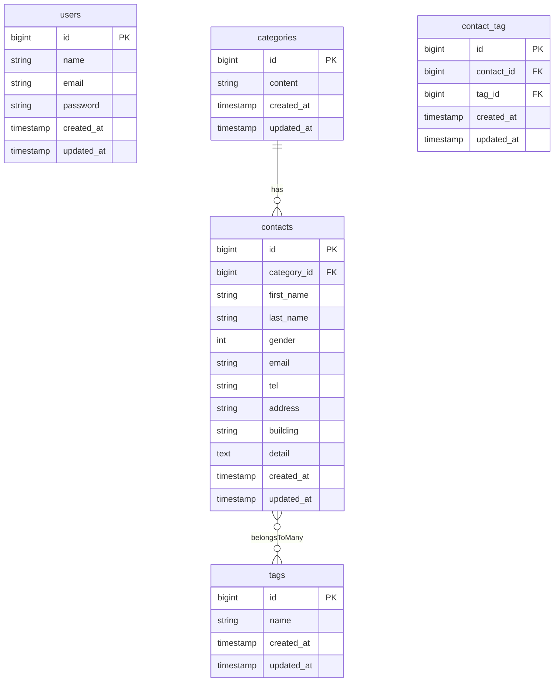

# COACHTECH お問い合わせフォームアプリ

お問い合わせフォームと管理機能を備えたLaravelアプリケーションです。

ユーザーからのお問い合わせ登録、管理者によるお問い合わせ一覧・検索・詳細確認・削除、タグ管理機能を実装しています。

## 作成者

石川　浩子

---

## 使用技術

### Backend
- PHP 8.2
- Laravel 10.x

### Database
- MySQL 8.0

### Web Server
- Nginx

### Frontend
- Vite
- Tailwind CSS 3.4.x

### Development Environment
- Docker
- Laravel Sail
- phpMyAdmin

### Code Format
- Laravel Pint

---

## ER図



---

## 開発環境URL

```
http://localhost
```

---

## 動作環境

- Docker Desktop
- Laravel Sail
- PHP 8.2以上
- MySQL 8.0
- Node.js / npm

---

## 環境構築手順

### 1. リポジトリをクローン

```bash
git clone https://github.com/hiroko-kiriten/contact-form-app.git
```

### 2. プロジェクトへ移動

```bash
cd contact-form-app
```

### 3. .envファイル作成

```bash
cp .env.example .env
```

### 4. Composerパッケージインストール

```bash
./vendor/bin/sail composer install
```

### 5. Laravel Sail起動

```bash
./vendor/bin/sail up -d
```

### 6. アプリケーションキー生成

```bash
./vendor/bin/sail artisan key:generate
```

### 7. データベース作成・初期データ投入

```bash
./vendor/bin/sail artisan migrate:fresh --seed
```

### 8. フロントエンド依存パッケージインストール

```bash
./vendor/bin/sail npm install
```

### 9. フロントエンドビルド

開発時：

```bash
./vendor/bin/sail npm run dev
```

## テスト実行

```bash
./vendor/bin/sail artisan test
```

実装済みテスト：

- Feature Test
- Unit Test

現在：

```
23 tests passed
42 assertions
```

---

## 機能一覧

### お問い合わせ機能

- お問い合わせフォーム表示
- 入力内容確認画面
- お問い合わせ登録
- サンクスページ表示

### 管理機能

- 管理者ログイン
- 管理画面アクセス制御
- お問い合わせ一覧表示
- キーワード検索
- ページネーション（7件）
- 詳細表示
- 削除機能

### タグ管理

- タグ新規登録
- タグ更新
- タグ名重複チェック

### API機能

- お問い合わせ一覧取得
- お問い合わせ詳細取得
- お問い合わせ登録
- お問い合わせ更新
- お問い合わせ削除

---

## バリデーション

バリデーションロジックはFormRequestクラスへ分離。

使用しているRequest：

- StoreContactRequest
- ContactRequest
- StoreTagRequest
- API用Request

---

## コードフォーマット

Laravel Pintを使用。

実行：

```bash
./vendor/bin/sail pint
```

---

## APIエンドポイント一覧

| Method | URI | 内容 |
|---|---|---|
| GET | /api/v1/contacts | お問い合わせ一覧取得 |
| GET | /api/v1/contacts/{contact} | 詳細取得 |
| POST | /api/v1/contacts | 登録 |
| PUT | /api/v1/contacts/{contact} | 更新 |
| DELETE | /api/v1/contacts/{contact} | 削除 |
