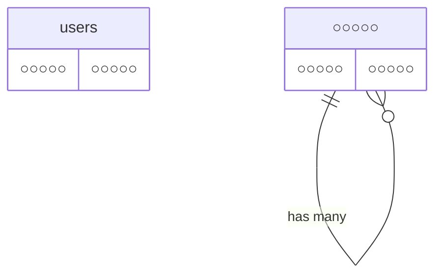

# COACHTECH お問合せフォームアプリ

○○○○○○ ○○○○○○ ○○○○○○ ○○○○○○ ○○○○○○ ○○○○○○
○○○○○○ ○○○○○○ ○○○○○○ ○○○○○○ ○○○○○○ ○○○○○○

## 作成者

石川浩子

## 使用技術

- ○○○○○ NN.NN
- ○○○○○ NN.NN
- ○○○○○ NN.NN
- ○○○○○ NN.NN
- ○○○○○ NN.NN

## ER図



## 開発環境URL

http://○○○○○

## 動作環境

○○○○○○ ○○○○○○ ○○○○○○ ○○○○○○ ○○○○○○ ○○○○○○
○○○○○○ ○○○○○○ ○○○○○○ ○○○○○○ ○○○○○○ ○○○○○○

## 環境構築手順

1. **リポジトリをクローン**

    ```bash
    git clone https://○○○○○○
    ```

2. **.envファイルの準備**

    ○○○○○○ ○○○○○○ ○○○○○○ ○○○○○○ ○○○○○○
    ○○○○○○ ○○○○○○ ○○○○○○ ○○○○○○ ○○○○○○

3. **Composer依存パッケージのインストール**

    ○○○○○○ ○○○○○○ ○○○○○○ ○○○○○○ ○○○○○○
    ○○○○○○ ○○○○○○ ○○○○○○ ○○○○○○ ○○○○○○

4. **Laravel Sailの起動**

    ○○○○○○ ○○○○○○ ○○○○○○ ○○○○○○ ○○○○○○
    ○○○○○○ ○○○○○○ ○○○○○○ ○○○○○○ ○○○○○○

5. **アプリケーションキーの生成**

    ○○○○○○ ○○○○○○ ○○○○○○ ○○○○○○ ○○○○○○
    ○○○○○○ ○○○○○○ ○○○○○○ ○○○○○○ ○○○○○○

6. **データベースのマイグレーションと初期データ投入**

    ○○○○○○ ○○○○○○ ○○○○○○ ○○○○○○ ○○○○○○
    ○○○○○○ ○○○○○○ ○○○○○○ ○○○○○○ ○○○○○○

7. **フロントエンドのビルド**

    ○○○○○○ ○○○○○○ ○○○○○○ ○○○○○○ ○○○○○○
    ○○○○○○ ○○○○○○ ○○○○○○ ○○○○○○ ○○○○○○

8. **アプリケーションへのアクセス**

    ○○○○○○ ○○○○○○ ○○○○○○ ○○○○○○ ○○○○○○
    ○○○○○○ ○○○○○○ ○○○○○○ ○○○○○○ ○○○○○○

## テスト実行

    ○○○○○○ ○○○○○○ ○○○○○○ ○○○○○○ ○○○○○○
    ○○○○○○ ○○○○○○ ○○○○○○ ○○○○○○ ○○○○○○

## 機能一覧

- ○○○○○○ ○○○○○○
- ○○○○○○ ○○○○○○
- ○○○○○○ ○○○○○○
- ○○○○○○ ○○○○○○
- ○○○○○○ ○○○○○○
- ○○○○○○ ○○○○○○

## APIエンドポイント一覧

○○○○○○ ○○○○○○ ○○○○○○ ○○○○○○ ○○○○○○ ○○○○○○ ○○○○○○ ○○○○○○ ○○○○○○

| HTTPメソッド | URI | 概要 |
|---|---|---|
| GET | /○○○○○○/○○○○○○/○○○○○○ | ○○○○○○ |
| GET | /○○○○○○/○○○○○○/○○○○○○ | ○○○○○○ |
| GET | /○○○○○○/○○○○○○/○○○○○○ | ○○○○○○ |
| GET | /○○○○○○/○○○○○○/○○○○○○ | ○○○○○○ |
| GET | /○○○○○○/○○○○○○/○○○○○○ | ○○○○○○ |
